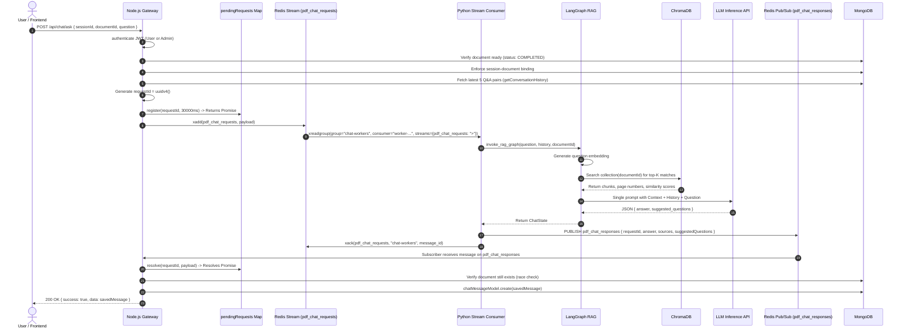
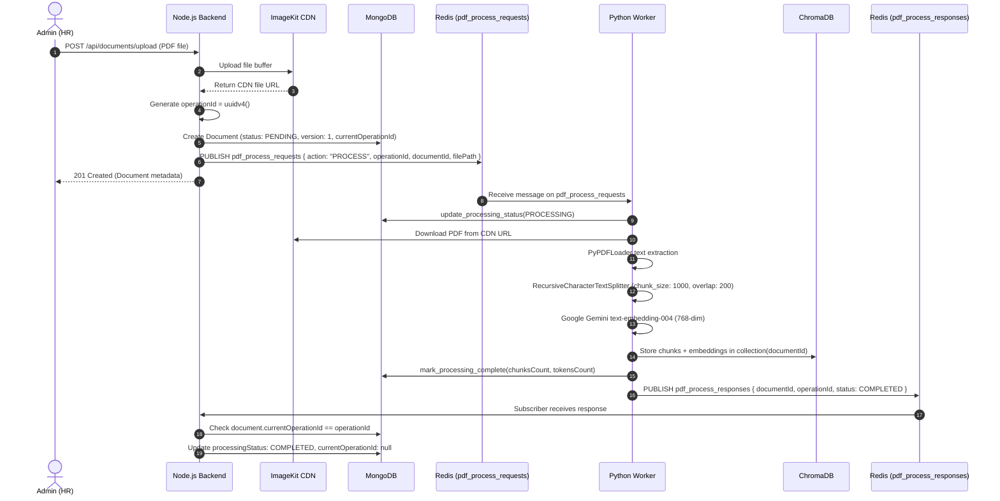

# Redis & Asynchronous Processing Architecture

This document provides an exhaustive, production-accurate breakdown of the Redis asynchronous messaging and processing architecture implemented in the Enterprise Knowledge-Base RAG System.

---

## 1. Redis's Role in the System

### Why Redis is Used
The system connects two fundamentally different microservices:
- **Node.js Express Backend (Gateway)**: Handles high-concurrency, I/O-bound web traffic, user authentication (JWT), RBAC authorization, and client HTTP request-response lifecycles.
- **Python AI Microservice (FastAPI + LangGraph)**: Executes compute-intensive, CPU/GPU-bound tasks such as PDF text extraction, document chunking, dense vector embeddings generation (Google Gemini), and multi-turn RAG reasoning (LangGraph + NVIDIA/Gemini LLM).

Running these AI workloads directly inside the Node.js event loop or synchronously over HTTP would tie up web worker threads, lead to client request timeouts, and tightly couple the two runtimes. Redis serves as the **decoupled, asynchronous communication backbone**:
1. **Asynchronous Task Offloading**: Offloads long-running PDF ingestion and vectorization tasks without blocking the Node.js API server.
2. **Durable Message Queuing**: Guarantees that chat queries are not lost if the Python AI service is temporarily busy or recovering.
3. **Event-Driven Communication**: Connects Node.js and Python without requiring direct service-to-service HTTP polling or exposure of internal ports.

### Communication Flow Through Redis
| Direction | Operation | Redis Mechanism | Redis Channel / Stream Name |
| :--- | :--- | :--- | :--- |
| **Node.js $\rightarrow$ Python** | Chat / RAG query dispatch | **Redis Stream** | `pdf_chat_requests` |
| **Python $\rightarrow$ Node.js** | Chat / RAG response delivery | **Redis Pub/Sub** | `pdf_chat_responses` |
| **Node.js $\rightarrow$ Python** | PDF process / reprocess / delete dispatch | **Redis Pub/Sub** | `pdf_process_requests` |
| **Python $\rightarrow$ Node.js** | PDF processing status notification | **Redis Pub/Sub** | `pdf_process_responses` |

### Service Responsibility Split
- **Node.js**:
  - Enforces client authentication and RBAC (`authenticate`, `requireAdmin`).
  - Stores binary PDF files in ImageKit CDN.
  - Acts as the System of Record in MongoDB for user accounts, document metadata, and chat message history.
  - Dispatches events to Redis Streams and Pub/Sub channels.
  - Manages client HTTP request lifecycles and in-memory promise correlation.
- **Python AI Service**:
  - Subscribes to Redis Pub/Sub channels and consumes from Redis Streams using consumer groups.
  - Downloads PDFs, extracts text with `PyPDFLoader`, and chunks text via `RecursiveCharacterTextSplitter`.
  - Generates 768-dimensional embeddings using Google Gemini `text-embedding-004`.
  - Manages vector indexing and similarity search in ChromaDB.
  - Executes LangGraph workflows (`retrieve_node` $\rightarrow$ `generate_node`) and communicates with LLM APIs.
  - Emits completion and error payloads back to Redis.

---

## 2. Redis Architecture & Channel Matrix

The project employs a **hybrid architecture** combining **Redis Streams** for durable queuing and **Redis Pub/Sub** for lightweight event broadcasting.

```mermaid
flowchart TB
    subgraph NodeBackend ["Node.js API Server"]
        Publisher["redisPublisher (ioredis)"]
        Subscriber["redisSubscriber (ioredis)"]
        PendingMap["pendingRequests (In-Memory Promise Map)"]
    end

    subgraph RedisBroker ["Redis Broker"]
        StreamChat[("Stream: pdf_chat_requests<br/>(Durable, PEL, Consumer Groups)")]
        ChannelProcessReq[("Pub/Sub Channel: pdf_process_requests")]
        ChannelProcessResp[("Pub/Sub Channel: pdf_process_responses")]
        ChannelChatResp[("Pub/Sub Channel: pdf_chat_responses")]
    end

    subgraph PythonWorker ["Python AI Service (RedisWorker)"]
        StreamConsumer["Stream Consumer<br/>(Group: chat-workers)"]
        PubSubListener["Pub/Sub Listener<br/>(pdf_process_requests)"]
        PyPublisher["Async Redis Publisher"]
    end

    Publisher -->|xadd()| StreamChat
    Publisher -->|publish()| ChannelProcessReq

    StreamChat -->|xreadgroup() / xautoclaim()| StreamConsumer
    ChannelProcessReq -->|listen()| PubSubListener

    PubSubListener -->|publish()| ChannelProcessResp
    StreamConsumer -->|publish()| ChannelChatResp
    StreamConsumer -->|xack()| StreamChat

    ChannelProcessResp -->|on('message')| Subscriber
    ChannelChatResp -->|on('message')| Subscriber
    Subscriber -->|resolve()| PendingMap
```

### Detailed Channel & Stream Configuration

| Name | Type | Publisher | Consumer | Payload Data Format |
| :--- | :--- | :--- | :--- | :--- |
| `pdf_chat_requests` | **Redis Stream** | Node.js (`xadd`) | Python (`xreadgroup`) | `{"type": "ask_question", "requestId": "...", "sessionId": "...", "documentId": "...", "question": "...", "conversationHistory": "[...]"}` |
| `pdf_chat_responses` | **Redis Pub/Sub** | Python (`publish`) | Node.js (`subscribe`) | `{"type": "ask_question_response", "requestId": "...", "answer": "...", "sources": [...], "suggestedQuestions": [...], "error": null, "timestamp": "..."}` |
| `pdf_process_requests` | **Redis Pub/Sub** | Node.js (`publish`) | Python (`subscribe`) | `{"type": "process_pdf", "operationId": "...", "documentId": "...", "filePath": "...", "fileName": "...", "action": "PROCESS" \| "REPROCESS" \| "DELETE"}` |
| `pdf_process_responses` | **Redis Pub/Sub** | Python (`publish`) | Node.js (`subscribe`) | `{"type": "process_pdf_response", "documentId": "...", "operationId": "...", "status": "COMPLETED" \| "FAILED", "chunksCreated": N, "totalTokens": N, "errorMessage": "..."}` |

---

## 3. Chat Request Flow

The Chat / RAG request lifecycle demonstrates how synchronous client REST requests are bridged with asynchronous queue processing:



### Key Steps in the Chat Pipeline:
1. **Pre-Flight Validation**: Node.js verifies that the document exists and has status `COMPLETED`. It guarantees the session has not been switched across different documents.
2. **Server-Side History**: Node.js fetches the last 5 conversation pairs directly from MongoDB. Client-supplied history is never trusted.
3. **In-Memory Correlation Registration**: Before calling `xadd`, Node.js registers `requestId` in `pendingRequests` with a 30-second timeout.
4. **Stream Dispatch**: The request is appended to the `pdf_chat_requests` stream.
5. **Consumer Group Read**: A Python worker reading from consumer group `chat-workers` consumes the message.
6. **LangGraph Processing**:
   - `retrieve_node`: Generates query embedding and performs similarity search in ChromaDB.
   - `generate_node`: Calls the LLM to generate both the answer and 3 follow-up suggested questions in a single JSON invocation.
7. **Response & Acknowledgment**: Python publishes the answer to `pdf_chat_responses` and then issues `xack` to acknowledge the stream entry.
8. **Promise Resolution & Persistence**: Node.js receives the pub/sub event, matches the `requestId`, verifies the document was not concurrently deleted, persists the Q&A exchange to MongoDB, and returns HTTP 200 to the client.

---

## 4. PDF Processing Flow

Document management is handled asynchronously via Redis Pub/Sub with strict status transitions recorded in MongoDB:



### 1. `PROCESS` (Upload Pipeline)
- Node.js uploads the PDF buffer to ImageKit, creates the document in MongoDB with `processingStatus: "PENDING"`, and assigns a new `operationId`.
- Publishes to `pdf_process_requests`. If `subscribers === 0`, Node.js marks the document as `FAILED` immediately.
- Python sets MongoDB status to `PROCESSING`, downloads the file, splits it into chunks, generates embeddings, stores them in ChromaDB under a collection named `documentId`, updates MongoDB with token and chunk counts, and publishes status `COMPLETED` to `pdf_process_responses`.

### 2. `REPROCESS` (Re-embedding Pipeline)
- Triggered by `GET /api/documents/:id/reprocess` (Admin-only).
- Node.js increments `processingVersion = processingVersion + 1`, generates a new `operationId`, resets status to `PENDING`, and publishes `{ action: "REPROCESS" }`.
- Python repeats the full ingestion pipeline, overwriting vectors in ChromaDB via `collection.upsert()`.
- Python emits completion on `pdf_process_responses`. Node.js updates status to `COMPLETED`.

### 3. `DELETE` (Cleanup Pipeline)
- Triggered by `DELETE /api/documents/:id` (Admin-only).
- Node.js records a new `operationId`, deletes the document record from MongoDB (`findByIdAndDelete`), and publishes `{ action: "DELETE", operationId, documentId }`.
- Python worker catches the `DELETE` action and immediately drops the entire ChromaDB collection:
  ```python
  await vector_store.delete_collection(document_id)
  ```
- Python publishes confirmation to `pdf_process_responses`.

---

## 5. Redis Streams Consumer Groups & Worker Lifecycle

The chat stream processing relies on Redis Streams consumer group mechanics implemented in `python-ai/app/redis/redis_worker.py`:

### 1. Group Initialization
On worker startup, the Python worker creates the consumer group if it does not already exist:
```python
await self.redis_client.xgroup_create(
    CHAT_STREAM_KEY,
    CHAT_CONSUMER_GROUP,
    id="0",        # Starts from the beginning of the stream
    mkstream=True, # Creates stream if not existing
)
```
If the group already exists, Redis returns a `BUSYGROUP` error, which the worker catches and ignores.

### 2. Worker Naming & Reading
- **Consumer Name**: Generated dynamically as `worker-<asyncio_task_name>` (e.g., `worker-main`).
- **Reading Unprocessed Messages**:
  ```python
  messages = await self.redis_client.xreadgroup(
      groupname=CHAT_CONSUMER_GROUP,
      consumername=self._chat_stream_consumer_name,
      streams={CHAT_STREAM_KEY: ">"},
      count=10,
      block=5000,
  )
  ```
  The special ID `>` instructs Redis to deliver only messages that have never been delivered to any consumer in this group.

### 3. Message Acknowledgment (`XACK`)
Acknowledgment is strictly performed **after** the RAG workflow finishes and the response is published:
```python
await self.route_message("pdf_chat_requests", message_data)
await self.redis_client.xack(CHAT_STREAM_KEY, CHAT_CONSUMER_GROUP, message_id)
```
If an error occurs during processing, `xack` is **not** called. The message remains in the Pending Entries List (PEL) of the stream.

### 4. Stale Message Recovery (`XAUTOCLAIM`)
Before reading new messages, the worker executes `_claim_stale_chat_messages()` to check for orphaned messages left behind by crashed or killed workers:
```python
next_start_id, messages, _ = await self.redis_client.xautoclaim(
    CHAT_STREAM_KEY,
    CHAT_CONSUMER_GROUP,
    self._chat_stream_consumer_name,
    min_idle_time=60_000, # 60 seconds idle threshold
    start_id=start_id,
    count=10,
)
for message_id, message_data in messages:
    await self._process_chat_stream_message(message_id, message_data)
```
Messages idle for more than 60,000 milliseconds (1 minute) are claimed by the current consumer, executed through LangGraph, and then acknowledged.

---

## 6. Reliability & Error Recovery Behavior

### What Happens When:
1. **Python Worker Disconnects / Restarts**:
   - **For Chat**: Requests published to `pdf_chat_requests` via `xadd()` are persisted in the Redis stream. When a worker reconnects, it immediately consumes and processes queued messages. (If the worker is down for longer than 30 seconds, the client's HTTP request will time out with `504 Gateway Timeout`).
   - **For Document Ingestion**: Ingestion requests published via Pub/Sub are ephemeral. When Node.js publishes to `pdf_process_requests`, it inspects `subscribers`. If `subscribers === 0`, Node.js immediately updates the document to `FAILED` with `"No Redis subscribers available"`.
2. **Redis Connection Drops**:
   - **Node.js**: `ioredis` automatically initiates reconnection retries using an exponential backoff formula (`min(times * 100, 2000)` ms).
   - **Python Worker**: The worker catches `RedisConnectionError`, `RedisTimeoutError`, and socket drops in `listen_forever()`. It closes broken connections silently, applies exponential backoff ($1.0\text{s} \rightarrow 2.0\text{s} \rightarrow 4.0\text{s} \dots 60.0\text{s}$), reconnects clients, re-subscribes to channels, ensures consumer groups exist, and restarts the stream consumer.
3. **A Message is Read but Not Acknowledged**:
   - The message remains in Redis's Pending Entries List (PEL).
   - Once its idle time exceeds 60 seconds, any active worker running `_claim_stale_chat_messages()` will reclaim the message via `XAUTOCLAIM` and re-execute it.
4. **Duplicate Processing Possibility**:
   - If Python finishes RAG processing and publishes the response to `pdf_chat_responses`, but crashes immediately before calling `xack`, the message will be reclaimed after 60 seconds by `xautoclaim`.
   - **Mitigation on Node.js**: The initial client request has either already been resolved or timed out. When the second response arrives on `pdf_chat_responses`, Node.js checks `pendingRequests.resolve(requestId)`. Since the entry is no longer present in the Map, Node.js logs a warning (`No pending request found for requestId...`) and ignores the duplicate. No duplicate messages are saved to MongoDB.

---

## 7. Request Correlation: `requestId` vs. `operationId`

The architecture uses two distinct correlation identifiers designed for two different distributed problem domains:

| Aspect | `requestId` | `operationId` |
| :--- | :--- | :--- |
| **Domain** | Chat & RAG Query Pipeline | Document Ingestion Lifecycle (Process, Reprocess, Delete) |
| **Origin** | `backend/src/modules/chat/chat.service.ts` | `backend/src/modules/documents/document.service.ts` |
| **Format** | UUIDv4 string | UUIDv4 string |
| **Storage Location** | In-memory in Node.js `pendingRequests` Map (with 30s TTL timer); persisted in MongoDB `chatmessages.requestId` on success. | Persisted in MongoDB `documents.currentOperationId` and `documents.processingVersion`. |
| **Transport** | Sent in `pdf_chat_requests` stream $\rightarrow$ echoed in `pdf_chat_responses` Pub/Sub. | Sent in `pdf_process_requests` Pub/Sub $\rightarrow$ echoed in `pdf_process_responses` Pub/Sub. |
| **Primary Problem Solved** | Bridges an asynchronous Redis messaging pipeline back to a waiting synchronous client HTTP connection. | Solves race conditions, out-of-order execution, and stale responses in long-running background tasks. |
| **Why Required for PDF Processing** | N/A | If an admin uploads a file and immediately triggers "Reprocess", or if a previous worker's delayed response arrives after a document was reprocessed or deleted, checking `document.currentOperationId !== operationId` ensures stale status updates are ignored. |

---

## 8. Pub/Sub vs. Redis Streams & The Protocol Mismatch

### The Protocol Mismatch Explained
In earlier iterations of Redis-based microservices, developers often attempt to use `XADD` on the producer side while listening with `SUBSCRIBE` on the consumer side. **These protocols do not interoperate:**
- **Redis Pub/Sub (`PUBLISH` / `SUBSCRIBE`)**:
  - A real-time, transient broadcasting mechanism.
  - Messages are pushed directly to currently active subscriber connection sockets.
  - If no consumer is listening at the exact microsecond of publication, the message evaporates.
  - Has no memory, no disk persistence, no message IDs, and no consumer groups.
- **Redis Streams (`XADD` / `XREADGROUP` / `XACK`)**:
  - A persistent, append-only distributed log data structure stored under a Redis key.
  - Messages remain stored until explicitly trimmed (`XTRIM` / `MAXLEN`).
  - Supports consumer groups, consumer offsets (`>`), and pending entry recovery.

If a publisher calls `XADD pdf_chat_requests * ...`, it appends an entry to a Stream log. A subscriber running `SUBSCRIBE pdf_chat_requests` listens to a Pub/Sub topic and will **never** receive the stream entry.

### The Current Implemented State
The system explicitly avoids this mismatch by cleanly separating protocols:
1. **Chat Ingestion**: Uses `xadd()` in Node.js and `xreadgroup()` in Python (Stream to Stream).
2. **Chat Response**: Uses `publish()` in Python and `subscribe()` in Node.js (Pub/Sub to Pub/Sub).
3. **Document Ingestion**: Uses `publish()` in Node.js and `subscribe()` in Python (Pub/Sub to Pub/Sub).

---

## 9. Message Lifecycle

### 9.1 Chat Message Lifecycle
```text
1. Client POST /api/chat/ask
   │
2. Node.js registers requestId in pendingRequests Map (30s timer)
   │
3. Node.js executes XADD to stream: pdf_chat_requests
   │
4. Message persists in stream log with auto-generated ID (e.g. 1725670000000-0)
   │
5. Python worker reads message via XREADGROUP (group: chat-workers, id: >)
   │
6. Message enters Pending Entries List (PEL) for that worker
   │
7. Python worker executes LangGraph (ChromaDB retrieval + LLM answer)
   │
8. Python worker PUBLISHES response to channel: pdf_chat_responses
   │
9. Python worker executes XACK (removes message from PEL)
   │
10. Node.js subscriber receives response, resolves pending Promise, saves to MongoDB, returns HTTP 200
```

### 9.2 PDF Processing Message Lifecycle
```text
1. Admin uploads PDF / requests Reprocess
   │
2. Node.js generates operationId and creates/updates MongoDB document (status: PENDING)
   │
3. Node.js executes PUBLISH to channel: pdf_process_requests
   │
4. Active Python worker receives message via Redis Pub/Sub listener
   │
5. Python updates MongoDB status to PROCESSING
   │
6. Python parses PDF, chunks, embeds, and upserts to ChromaDB
   │
7. Python updates MongoDB status to COMPLETED
   │
8. Python executes PUBLISH to channel: pdf_process_responses (with operationId)
   │
9. Node.js validates operationId matches document.currentOperationId, clears operationId lock
```

---

## 10. Failure Scenarios Matrix

| Scenario | Current Implemented Behavior | Risk / Limitation |
| :--- | :--- | :--- |
| **Python worker down during chat request** | Message remains queued in `pdf_chat_requests` stream. If worker does not recover within 30 seconds, Node.js triggers `504 Gateway Timeout`. When worker eventually starts, it reads and processes the stream message. | Client receives 504. The response published later will find no entry in `pendingRequests` and is dropped. |
| **Python worker down during PDF upload** | Node.js detects `subscribers === 0` from `publish()`. Immediately marks MongoDB document as `FAILED` with `"No Redis subscribers available"`. | Upload fails immediately; does not retry automatically. Admin must click "Reprocess" once the worker is back online. |
| **Worker crashes during LangGraph LLM generation** | Message is not acknowledged (`XACK` was never called). Message remains in stream PEL. | Client request times out after 30s (`504 Gateway Timeout`). After 60s, another worker reclaims it via `XAUTOCLAIM`. |
| **Worker crashes after publishing response but before `XACK`** | Client receives HTTP 200 successfully. The stream entry remains unacknowledged in PEL. | After 60s, `XAUTOCLAIM` reclaims the message. Worker re-generates answer and re-publishes. Node.js logs warning and discards duplicate. |
| **Redis connection temporarily drops** | Node.js `ioredis` retries every 100–2000ms. Python worker catches error, closes sockets, executes exponential backoff ($1\text{s} \dots 60\text{s}$), and reconnects. | Any in-flight requests during the exact drop window fail with connection errors. |
| **Redis publish with 0 subscribers on document upload** | Node.js catches `subscribers === 0` and marks document `FAILED`. | Handled cleanly, preventing documents from remaining stuck in `PENDING` indefinitely. |
| **Concurrent Reprocess / Delete race condition** | Every request carries an incremented `processingVersion` and fresh `operationId`. Node.js subscriber validates `operationId == currentOperationId`. | Stale responses from slow previous runs are safely discarded. |

---

## 11. Practical Interview Questions & Answers

### Q1: Why did you use Redis Streams for chat requests instead of standard Redis Pub/Sub?
> **Answer**: Redis Pub/Sub is fire-and-forget. If the Python AI service is restarting, busy, or temporarily disconnected, any question sent over Pub/Sub is permanently lost. Redis Streams provides an append-only, persistent log with consumer groups (`chat-workers`). Messages are safely queued, distributed across workers, tracked in a Pending Entries List (PEL), and only removed from the pending state once explicitly acknowledged with `XACK`.

### Q2: How does the system handle a Python worker crashing while processing an LLM query?
> **Answer**: The worker only issues `XACK` after the LangGraph RAG pipeline succeeds and the response is published. If the worker crashes mid-generation, the message remains unacknowledged in the Redis Stream's PEL. Every worker periodically executes `XAUTOCLAIM` looking for messages idle for longer than 60 seconds (`min_idle_time=60000`). When found, an active worker reclaims ownership of the message and re-processes it.

### Q3: How do you bridge the asynchronous Redis message pipeline with a synchronous client HTTP request?
> **Answer**: Using the **Request Correlation Pattern**. When the client sends `POST /api/chat/ask`, Node.js generates a unique UUID `requestId`. It registers this ID in an in-memory Map (`pendingRequests`) with a Promise and a 30-second timeout. The `requestId` is passed through the Redis stream to Python and returned in the Pub/Sub response. When Node.js receives the response, it matches the `requestId` in the Map and resolves the Promise, allowing the HTTP controller to return the response to the client.

### Q4: What is the difference between `requestId` and `operationId` in your codebase?
> **Answer**: `requestId` is an **ephemeral in-memory correlation ID** for synchronous chat queries; it lives in a Node.js Map for at most 30 seconds to correlate the client's HTTP response. `operationId` is a **persistent state-reconciliation token** stored in MongoDB on the Document record. It prevents race conditions during long-running PDF processing (e.g., if an admin triggers a reprocess or delete, any late-arriving responses from previous processing jobs are rejected if their `operationId` does not match `document.currentOperationId`).

### Q5: Why did you use Pub/Sub for chat responses instead of another Redis Stream?
> **Answer**: Chat responses are intended solely for the specific Node.js API instance that holds the waiting client HTTP connection in memory. Since the response only needs to be delivered once in real time to resolve the Promise, Pub/Sub provides low-latency broadcasting. If Node.js restarts or times out, an unread response does not need to persist in a stream.

### Q6: What was the "protocol mismatch" issue and why can't you `SUBSCRIBE` to an `XADD` stream?
> **Answer**: Redis Pub/Sub and Redis Streams are completely separate subsystems within Redis. `XADD` appends structured data to a persistent stream key, whereas `SUBSCRIBE` listens to an ephemeral pub/sub channel. A subscriber will never receive messages pushed via `XADD`. To consume a stream, a client must use `XREAD` or `XREADGROUP`.

### Q7: Can duplicate processing happen, and how does your system guard against it?
> **Answer**: Yes. If Python generates an answer and publishes it to Redis, but crashes before issuing `XACK`, `XAUTOCLAIM` will claim the message 60 seconds later and re-execute it. However, the client's HTTP request has already finished (or timed out after 30s). When the duplicate response arrives on `pdf_chat_responses`, Node.js finds no entry in `pendingRequests` and drops it, ensuring no duplicate messages are saved to MongoDB.

### Q8: What happens if a client asks a question about a document that is being deleted at the same time?
> **Answer**: We implemented a concurrency check (`REL-03`). Before saving the completed chat exchange to MongoDB, Node.js re-queries MongoDB: `await documentModel.findById(documentId).select("_id").lean()`. If the document was deleted while Python was generating the answer, Node.js aborts message persistence and returns HTTP 410 Gone.

---

## 12. Known Limitations & Production Considerations

1. **Single Node.js Instance In-Memory Map**:
   - `pendingRequests` is currently stored in memory on the local Node.js process. If multiple Node.js instances are deployed behind a load balancer, the instance receiving the Pub/Sub response might not be the instance holding the client's HTTP connection.
   - *Production Solution*: Use Redis Keyspace Notifications or partition Pub/Sub channels per Node.js instance ID (e.g., `pdf_chat_responses:${instanceId}`).
2. **Ephemeral Document Ingestion**:
   - Document ingestion uses Pub/Sub (`pdf_process_requests`). If no Python worker is running when an upload occurs, the upload fails immediately rather than queuing.
   - *Production Solution*: Migrate `pdf_process_requests` to a dedicated Redis Stream with its own consumer group.
3. **ChromaDB Local Persistence**:
   - ChromaDB runs as an embedded persistent client on local disk storage (`./chroma_data`). Scaling Python workers horizontally requires a centralized, networked ChromaDB instance or external vector database (e.g., Pinecone, Qdrant, or pgvector).

---

## 13. Final Architecture Summary (Interview Elevator Pitch)

> "Our RAG system decouples the Node.js API gateway from the Python AI service using Redis as an asynchronous event broker. We use **Redis Streams** with consumer groups (`chat-workers`) and explicit `XACK` acknowledgments for chat requests to guarantee at-least-once delivery and prevent query loss during worker reboots. A background recovery loop uses **`XAUTOCLAIM`** to reprocess orphaned requests idle for over 60 seconds. We bridge the asynchronous stream back to synchronous client HTTP requests using an in-memory **Request Correlation Pattern** (`requestId` mapped to Promises with 30-second timeouts). For document ingestion, we coordinate state using **Redis Pub/Sub** paired with **Optimistic Concurrency Control** via `operationId` in MongoDB, ensuring stale background processing responses never overwrite active document states."
