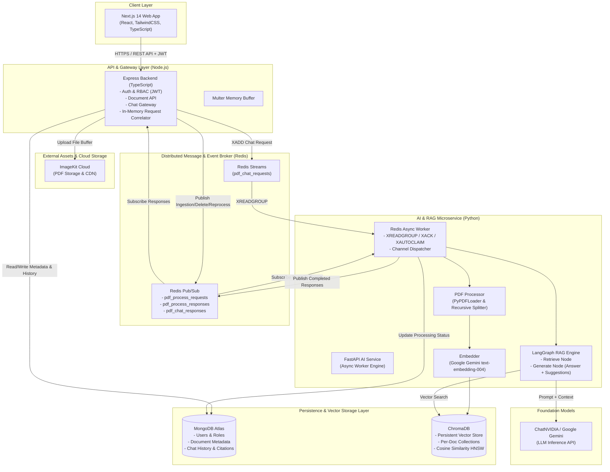
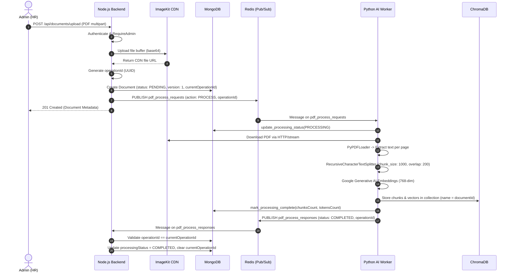
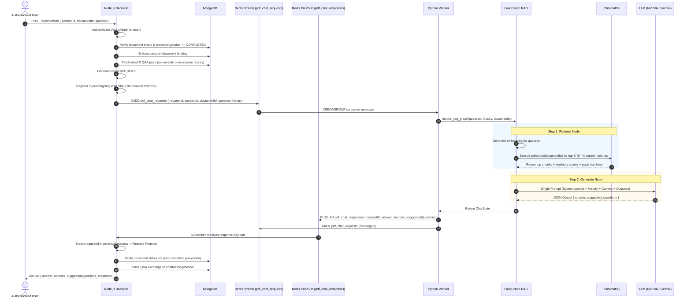
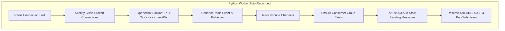

# Enterprise Knowledge-Base RAG System — Architecture & Design Specification

This document details the production architecture, data flow, distributed messaging mechanisms, and design decisions of the Enterprise Knowledge-Base Retrieval-Augmented Generation (RAG) System.

---

## 1. High-Level Architecture Overview

The system is built as a distributed, polyglot microservice architecture designed for enterprise knowledge management and AI-powered document questioning.



---

## 2. End-to-End System Flow

The system orchestrates three primary layers:
1. **Frontend (Next.js)**: Authenticated user interface offering chat interaction, document selection, and admin document management.
2. **Backend Gateway (Node.js Express + TypeScript)**: Enforces RBAC, orchestrates file upload to ImageKit, manages database persistence in MongoDB, and dispatches tasks to Redis.
3. **AI Processing Engine (Python FastAPI + LangGraph)**: Consumes tasks from Redis, handles PDF extraction/chunking, embedding generation, ChromaDB vector indexing, and LangGraph-driven RAG retrieval.

---

## 3. Why Node.js and Python are Separated

A core architectural decision is decoupling the API/Application server (Node.js) from the AI Computation engine (Python):

| Dimension | Node.js Backend (Gateway & Application API) | Python AI Service (Compute & ML Engine) |
| :--- | :--- | :--- |
| **Primary Role** | Client routing, JWT authentication, RBAC authorization, CRUD operations, fast I/O multiplexing. | PDF text extraction, document chunking, vector embedding generation, vector similarity search, LangGraph workflow execution. |
| **Concurrency Model** | Non-blocking event loop optimized for thousands of concurrent, I/O-bound web requests. | CPU-intensive chunking, mathematical vector transformations, and asynchronous AI agent graph execution. |
| **Ecosystem Strengths** | Superior web frameworks (Express/Next.js), frontend-backend type sharing, lightweight memory footprint. | Native AI/ML ecosystem (LangChain, LangGraph, ChromaDB, NumPy, PyPDF). |
| **Fault Isolation** | A crash or high memory consumption in heavy document chunking/LLM processing never takes down the API gateway or user auth. | AI workers can scale horizontally or restart independently without dropping client HTTP connections. |
| **Scaling Dynamics** | Scales horizontally based on HTTP user concurrency. | Scales horizontally based on vector processing and LLM throughput requirements. |

---

## 4. Redis Architecture: Streams, Pub/Sub, and Reliability

The system uses a hybrid Redis architecture leveraging both **Redis Streams** and **Redis Pub/Sub** tailored to the durability requirements of different operations.

```mermaid
flowchart LR
    subgraph StreamFlow ["Chat Pipeline (Redis Streams - At-Least-Once Delivery)"]
        NodeChat["Node.js<br/>xadd()"] -->|XADD pdf_chat_requests| Stream[("Stream:<br/>pdf_chat_requests")]
        Stream -->|XREADGROUP<br/>group: chat-workers<br/>consumer: worker-{id}| PyWorker["Python Worker"]
        PyWorker -->|XACK on success| Stream
        PyWorker -.->|XAUTOCLAIM (idle > 60s)| Stream
        PyWorker -->|PUBLISH pdf_chat_responses| PubSubResp[("Pub/Sub:<br/>pdf_chat_responses")]
        PubSubResp -->|Resolve pending Promise| NodeChat
    end
```

### 4.1 Redis Streams vs. Redis Pub/Sub

- **Redis Streams (`pdf_chat_requests`)**:
  - Used for **Chat & RAG queries**.
  - Provides persistent log storage, consumer groups, message acknowledgment (`XACK`), and pending message tracking.
  - Ensures queries are not dropped if Python AI workers are momentarily busy or restarting.
- **Redis Pub/Sub (`pdf_process_requests`, `pdf_process_responses`, `pdf_chat_responses`)**:
  - Used for **Document Ingestion trigger/status notifications** and **Chat Response delivery**.
  - Lightweight, high-throughput fire-and-forget channel for fast inter-service message broadcasting.

### 4.2 Consumer Groups, ACK, and XAUTOCLAIM

1. **Consumer Group (`chat-workers`)**:
   - Python workers initialize the consumer group `chat-workers` with `xgroup_create(CHAT_STREAM_KEY, CHAT_CONSUMER_GROUP, id="0", mkstream=True)`.
   - Distributes incoming user questions across multiple concurrent worker instances using `>`.
2. **Explicit Acknowledgment (`XACK`)**:
   - When a chat request is successfully processed and published, the worker executes:
     ```python
     await self.redis_client.xack(CHAT_STREAM_KEY, CHAT_CONSUMER_GROUP, message_id)
     ```
   - If an error occurs during processing, the message is **not** ACKed, leaving it in the Pending Entries List (PEL).
3. **Dead-Worker Recovery (`XAUTOCLAIM`)**:
   - The worker periodically invokes `xautoclaim` with `min_idle_time=60_000` (60 seconds) to claim and re-execute messages that were assigned to crashed or terminated worker consumers:
     ```python
     next_start_id, messages, _ = await self.redis_client.xautoclaim(
         CHAT_STREAM_KEY,
         CHAT_CONSUMER_GROUP,
         self._chat_stream_consumer_name,
         min_idle_time=60_000,
         start_id=start_id,
         count=10,
     )
     ```

### 4.3 `requestId` vs. `operationId`

The architecture strictly distinguishes between two correlation identifiers:

| Property | `requestId` | `operationId` |
| :--- | :--- | :--- |
| **Domain** | Chat / RAG query pipeline | Document lifecycle (Process, Reprocess, Delete) |
| **Nature** | Ephemeral, synchronous HTTP-over-async-broker | Persistent, asynchronous state reconciliation |
| **Lifecycle** | Generated in Node.js `chatService`, stored in-memory in `pendingRequests` Map with a 30-second TTL. | Generated in Node.js `documentService`, persisted in MongoDB on the `Document` document. |
| **Purpose** | Correlates outgoing Redis stream request with incoming `pdf_chat_responses` Pub/Sub message to resolve the waiting HTTP Promise. | Guards against race conditions and stale responses from outdated background processing tasks. |
| **Concurrency Control** | Cleared when HTTP response returns or on 30s timeout (`504 Gateway Timeout`). | Validated against `document.currentOperationId` and `processingVersion`. If mismatched, the response is discarded. |

---

## 5. Document Ingestion Lifecycle



### Ingestion Steps Breakdown:
1. **Upload & Storage**: Admin uploads PDF $\rightarrow$ Node.js streams buffer to ImageKit $\rightarrow$ receives secure public CDN URL.
2. **Database Initialization**: Document record created in MongoDB with status `PENDING`, `processingVersion: 1`, and `currentOperationId`.
3. **Dispatch**: Node.js publishes event to `pdf_process_requests`.
4. **Extraction & Chunking**: Python worker downloads PDF from ImageKit URL, parses pages via `PyPDFLoader`, and chunks text via `RecursiveCharacterTextSplitter` (1,000 characters with 200 character overlap).
5. **Vector Embedding**: Generates 768-dimensional dense vectors using Google Gemini `text-embedding-004`.
6. **ChromaDB Upsert**: Inserts chunks, embeddings, and metadata into a dedicated collection named after the `documentId`.
7. **Status Finalization**: Python marks MongoDB document as `COMPLETED` and emits response on `pdf_process_responses`. Node.js validates `operationId` and clears the active operation lock.

---

## 6. Reprocess and Delete Workflows

### 6.1 Reprocess Flow (`GET /api/documents/:id/reprocess`)
1. Admin initiates reprocess request.
2. Node.js generates a new `operationId`, increments `processingVersion = processingVersion + 1`, and resets status to `PENDING`.
3. Node.js publishes `{ action: "REPROCESS", operationId, documentId, filePath }` to `pdf_process_requests`.
4. Python re-runs PDF download, chunking, and embedding generation, then overwrites existing vectors in ChromaDB using `collection.upsert()`.
5. Upon completion, Python publishes to `pdf_process_responses`. Node.js validates `operationId` matches `document.currentOperationId`, setting status to `COMPLETED`.

### 6.2 Delete Flow (`DELETE /api/documents/:id`)
1. Admin requests document deletion.
2. Node.js marks `currentOperationId` and deletes the document metadata from MongoDB (`findByIdAndDelete`).
3. Node.js publishes `{ action: "DELETE", operationId, documentId }` to `pdf_process_requests`.
4. Python receives `DELETE` action and immediately drops the entire vector collection from ChromaDB:
   ```python
   await vector_store.delete_collection(document_id)
   ```
5. Python confirms deletion via `pdf_process_responses`.

---

## 7. Chat / RAG Query Lifecycle



---

## 8. Database Responsibilities

### 8.1 MongoDB (Relational & Metadata System of Record)
MongoDB acts as the authoritative source of truth for:
- **User Accounts & RBAC**: User identity, password hashes, and assigned roles (`admin` vs `user`).
- **Document Metadata**: File paths, ImageKit URLs, upload timestamp, ownership references, processing statuses (`PENDING`, `PROCESSING`, `COMPLETED`, `FAILED`), failure error logs, and concurrency control tags (`processingVersion`, `currentOperationId`).
- **Chat Conversations & History**: Persisted questions, generated answers, suggested questions, and normalized citations (`documentName`, `pageNumber`, `excerpt`, `similarity`).
- **Session Constraints**: Guarantees that a single `sessionId` is bound to a single `documentId`.

### 8.2 ChromaDB (Dense Vector Store)
ChromaDB is dedicated exclusively to embedding indexation and similarity search:
- **Collection-Per-Document Isolation**: Each document has its own Chroma collection keyed by `documentId`.
- **HNSW Indexing**: Configured with `{"hnsw:space": "cosine"}` for cosine similarity metric retrieval.
- **Fast Chunk Retrieval**: Fetches top-$K$ ($K=4$) semantic matches with metadata containing page numbers and chunk offsets.

---

## 9. Failure, Recovery, and Reconnection Architecture



1. **Transient Redis Connection Failures**:
   - The Python `RedisWorker` traps `RedisConnectionError`, `RedisTimeoutError`, and socket drops.
   - Connections are closed silently and re-established with exponential backoff ($1.0\text{s} \rightarrow 60.0\text{s}$).
   - Pub/Sub sockets utilize `socket_timeout=None` for indefinite blocking reads, while command clients use finite timeouts with keepalive pings (`health_check_interval=15s`).
2. **AI Service Request Timeouts**:
   - Node.js registers every chat request in `pendingRequests` with a 30-second timer.
   - If Python fails to respond within 30 seconds, Node.js returns `504 Gateway Timeout` and cleans up memory references.
3. **Concurrent Deletion Race Conditions (REL-03)**:
   - If a document is deleted while a RAG query is in-flight in Python, Node.js re-validates document existence before persisting the chat message. If deleted, it halts persistence and returns `410 Gone`.
4. **Graceful Shutdown**:
   - In-flight background tasks in Python are tracked in `_active_tasks`. On `SIGINT`/`SIGTERM`, the worker grants a 25-second drain window before terminating connections.

---

## 10. Key Architectural Decisions and Rationale

### 1. In-Memory Request Correlation via `pendingRequests`
- **Decision**: Bridge asynchronous Redis messaging with synchronous client HTTP requests using an in-memory Map of Promises (`pendingRequests`).
- **Why**: Keeps client interfaces clean and synchronous (REST `POST /api/chat/ask`) while preserving a fully decoupled, non-blocking asynchronous message queue architecture on the backend.

### 2. Redis Streams for Chat, Pub/Sub for Ingestion
- **Decision**: Use Redis Streams (`XADD`, `XREADGROUP`, `XACK`) for chat queries and Pub/Sub for document ingestion events.
- **Why**: Chat interactions require at-least-once delivery, consumer group load balancing, and crash recovery (`XAUTOCLAIM`). Document ingestion is a long-running background task tracked directly in MongoDB status columns.

### 3. Collection-Per-Document in ChromaDB
- **Decision**: Create a distinct Chroma collection for each document (`name=documentId`) instead of storing all documents in a single shared index with metadata filters.
- **Why**:
  1. **Instant Deletion**: Deleting a document is an $O(1)$ collection drop rather than an expensive scan-and-delete on millions of vector rows.
  2. **Zero Cross-Document Leakage**: Guarantees complete retrieval isolation between documents during RAG search.
  3. **High Retrieval Performance**: Vector search space is restricted solely to the target document's chunks.

### 4. Server-Side Conversation History Construction
- **Decision**: Node.js fetches the latest 5 Q&A pairs from MongoDB and transmits them to Python; client-supplied conversation history is rejected.
- **Why**: Prevents prompt injection, conversation tampering, and context window abuse from malicious clients.

### 5. Combined Answer + Suggested Questions in Single LLM Call
- **Decision**: Node 2 in LangGraph generates both the final response text and 3 follow-up questions in a single JSON payload.
- **Why**: Reduces LLM inference latency by 50% and eliminates redundant prompt token consumption compared to running two sequential LLM calls.

### 6. Strict Multi-Layer RBAC
- **Decision**: Authentication and Authorization are separated into distinct middlewares (`authenticate` vs `requireAdmin`).
- **Why**: Protects shared endpoints (`GET /api/documents`, `POST /api/chat/ask`) for all authenticated employees while restricting document mutation (`POST /upload`, `DELETE /:id`, `GET /:id/reprocess`) exclusively to HR/Admins.
