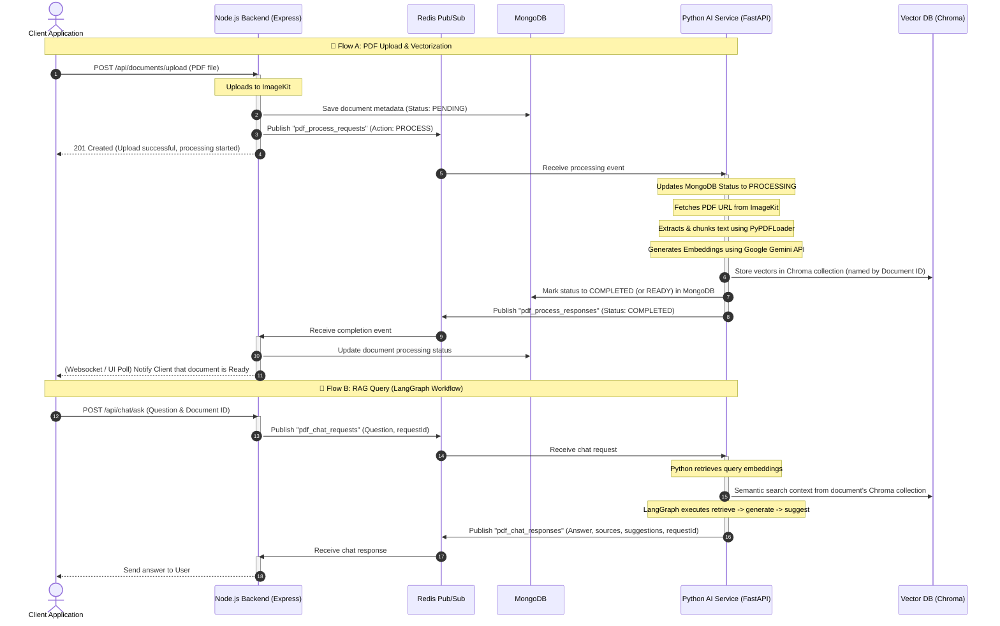

# Architectural Communication Guide: Node.js Backend & Python AI Service

This document defines the communication protocols, channels, message schemas, and architecture used to link the **Node.js Express Backend** and the **Python FastAPI AI Service**. It also identifies the current alignment gaps in the repository and provides concrete steps to resolve them.

---

## 1. Communication Architecture Overview

To achieve clean decoupling, the RAG Chatbot architecture uses a **hybrid model**:
1. **HTTP/REST (Synchronous)**: Used for health checks, initial bootstrapping, and direct service monitoring.
2. **Redis Pub/Sub (Asynchronous)**: Used for event-driven message exchange. This decouples the Node.js server (responsible for client connections, authentication, and HTTP routing) from the Python AI service (responsible for resource-intensive PDF parsing, Google Gemini embedding generation, ChromaDB vector indexing, and LangGraph multi-agent RAG reasoning).

### Architectural Interaction Flow



---

## 2. Pub/Sub Channels Specification

To avoid communication breakdowns, both services must subscribe and publish to the exact same channel names. 

| Logical Flow | Channel Name | Publisher | Subscriber | Description |
| :--- | :--- | :--- | :--- | :--- |
| **PDF Ingestion** | `pdf_process_requests` | Node.js | Python AI | Triggers PDF chunking, embedding, and vector storage. |
| **PDF Ingestion Response** | `pdf_process_responses` | Python AI | Node.js | Reports ingestion success/failure and updates metadata. |
| **RAG Chat Query** | `pdf_chat_requests` | Node.js | Python AI | Sends user queries to the LangGraph AI workflow. |
| **RAG Chat Response** | `pdf_chat_responses` | Python AI | Node.js | Returns LLM answers, retrieved sources, and suggested follow-ups. |

---

## 3. JSON Message Schemas

To ensure message payloads are parsed successfully, the JSON structures must adhere to the schemas defined below.

### 3.1 PDF Ingestion Requests (`pdf_process_requests`)

Every message sent from the Node.js backend must include a `type` and `action` field to route processing logic correctly.

#### Schema definition:
```json
{
  "type": "process_pdf",
  "action": "PROCESS" | "REPROCESS" | "DELETE",
  "documentId": "string (MongoDB ObjectId)",
  "filePath": "string (HTTP/HTTPS URL from ImageKit)",
  "fileName": "string (Original filename)"
}
```

*Note: For the `DELETE` action, only the `type`, `action`, and `documentId` fields are required.*

---

### 3.2 PDF Ingestion Responses (`pdf_process_responses`)

Sent by the Python AI worker once ingestion is finalized or crashes.

#### Schema definition:
```json
{
  "type": "process_pdf_response",
  "documentId": "string (MongoDB ObjectId)",
  "status": "COMPLETED" | "FAILED",
  "chunksCreated": 0,
  "embeddingsGenerated": 0,
  "totalTokens": 0,
  "error": "string | null",
  "timestamp": "string (ISO 8601 Date)"
}
```

---

### 3.3 Chat/RAG Requests (`pdf_chat_requests`)

Sent by Node.js to trigger the LangGraph orchestration.

#### Schema definition:
```json
{
  "type": "ask_question",
  "requestId": "string (UUID v4 for correlation)",
  "sessionId": "string (Session identifier)",
  "question": "string (User query text)",
  "conversationHistory": [
    {
      "role": "user" | "assistant",
      "content": "string"
    }
  ]
}
```

---

### 3.4 Chat/RAG Responses (`pdf_chat_responses`)

Published by Python back to Node.js.

#### Schema definition:
```json
{
  "type": "ask_question_response",
  "requestId": "string (UUID v4 from original request)",
  "answer": "string | null",
  "sources": [
    {
      "text": "string (Chunk text content)",
      "similarity": 0.0,
      "page_number": 0,
      "metadata": {}
    }
  ],
  "suggestedQuestions": [
    "string"
  ],
  "error": "string | null",
  "timestamp": "string (ISO 8601 Date)"
}
```

---

## 4. Identified Alignment Gaps (Critical Action Items)

A thorough review of the current implementation in [`backend`](file:///c:/Users/ghans/Devloper/RAG-Chatbot/backend) and [`python-ai`](file:///c:/Users/ghans/Devloper/RAG-Chatbot/python-ai) reveals the following discrepancies that will prevent the services from communicating correctly.

### 4.1 Chat Channel Name Mismatch
> [!IMPORTANT]
> **Discrepancy:**
> * In `backend/src/redis/channels.ts`, the channels are named:
>   * `pdf_chat_requests` (value: `"pdf_chat_requests"`)
>   * `pdf_chat_responses` (value: `"pdf_chat_responses"`)
> * In `python-ai/app/redis/redis_worker.py`, the worker subscribes to:
>   * `"chat_requests"`
>   * And publishes to `"chat_responses"`.
>
> **Solution:**
> Update Python's subscription list and publishing statement to match the Node.js channel names:
> * Subscribe: `"pdf_chat_requests"`
> * Publish: `"pdf_chat_responses"`

### 4.2 Payload Schema Envelope Mismatch (Missing `type` Field)
> [!WARNING]
> **Discrepancy:**
> * `python-ai`'s worker routes messages based on `payload.get("type")` (e.g. checking if it equals `"process_pdf"` or `"ask_question"`).
> * In `backend/src/modules/documents/document.service.ts`, the payload published for uploads is:
>   ```typescript
>   const payload = JSON.stringify({
>     documentId: document._id,
>     filePath: document.filePath,
>     fileName: document.fileName,
>     action: "PROCESS",
>   });
>   ```
>   Since the `type` field is missing, the message will fail routing checks inside `redis_worker.py` and print: `Unknown message type 'None' on channel 'pdf_process_requests'`.
>
> **Solution:**
> Update the payload published by the Node.js `uploadDocument`, `reprocessDocument`, and `deleteDocuments` handlers to explicitly include `"type": "process_pdf"`.

### 4.3 Ingestion Actions Handler (PROCESS, REPROCESS, DELETE)
> [!NOTE]
> **Discrepancy:**
> * Node.js supports three document management actions: `"PROCESS"`, `"REPROCESS"`, and `"DELETE"`.
> * Python's `redis_worker.py` currently assumes all messages are for loading/embedding (`handle_pdf_process_request`). It does not distinguish between actions and does not support collection deletion.
>
> **Solution:**
> Enhance Python's `route_message` and `handle_pdf_process_request` functions:
> 1. If `action` is `"DELETE"`, call `ChromaVectorStore.delete_collection(document_id)` to wipe vector records.
> 2. If `action` is `"PROCESS"` or `"REPROCESS"`, invoke the document parser and vector storer.

### 4.4 Local Path Verification vs. ImageKit URLs
> [!IMPORTANT]
> **Discrepancy:**
> * In `backend`, documents are uploaded to ImageKit, returning a remote HTTP/HTTPS url (e.g., `https://ik.imagekit.io/...`). This is saved to `filePath`.
> * In `python-ai/app/ingestion/pdf_processor.py` (lines 55-56), the worker executes:
>   ```python
>   if not os.path.exists(file_path):
>       raise FileNotFoundError(f"PDF file not found: {file_path}")
>   ```
>   This will fail for remote URLs, aborting document parsing before it can load.
>
> **Solution:**
> Modify the PDF loading logic:
> 1. Detect if `file_path` starts with `http://` or `https://`.
> 2. If it is a URL, skip `os.path.exists` and `os.access` checks, and pass the URL directly to `PyPDFLoader` (which supports remote URLs natively), or download the file locally to a temp folder first.

### 4.5 Status Enum Alignment
> [!WARNING]
> **Discrepancy:**
> * Node's MongoDB mongoose schema enforces uppercase values for `processingStatus`: `["PENDING", "PROCESSING", "COMPLETED", "FAILED"]`.
> * Python's MongoDB client (`mongo_client.py` line 121) sets status directly to `"ready"`, and the Redis payload uses `"completed"`.
> * Node's subscriber updates the database directly using whatever string Python sends in `payload.status` (which is lowercase `"completed"` or `"failed"`), leading to validation/format inconsistency.
>
> **Solution:**
> Standardize on uppercase statuses in both services:
> * Use `"PENDING"` when upload initiates.
> * Use `"PROCESSING"` when Python begins ingestion.
> * Use `"COMPLETED"` (or `"READY"`) once vectors are indexed.
> * Use `"FAILED"` if any step fails.
> Make sure both Python's MongoDB client direct updates and Redis payloads use these exact capitalized values.

### 4.6 Reprocess Route Method
> [!NOTE]
> **Discrepancy:**
> * In `backend/src/modules/documents/document.routes.ts` line 30, the route is configured as:
>   `router.get("/:id/reprocess", ...)`
> * Reprocessing updates state (resets status to `PENDING`), which is a state change operation and should logically be a `POST` method.
>
> **Solution:**
> Change `router.get` to `router.post` for the reprocess endpoint.

---

## 5. Summary Action Checklist for Developer

To establish complete, error-free communication, execute these updates in the respective codebases:

### Node.js Backend Tasks
- [ ] **Align Router**: In [`document.routes.ts`](file:///c:/Users/ghans/Devloper/RAG-Chatbot/backend/src/modules/documents/document.routes.ts), change the reprocess route to `router.post("/:id/reprocess", ...)`.
- [ ] **Standardize Schema Payload**: In [`document.service.ts`](file:///c:/Users/ghans/Devloper/RAG-Chatbot/backend/src/modules/documents/document.service.ts), add `"type": "process_pdf"` to all payloads published to the `PDF_PROCESS_REQUESTS` channel.
- [ ] **Handle Incoming Chat Channel**: Implement a Chat Module that publishes to `pdf_chat_requests` and subscribes to `pdf_chat_responses` to return solutions to the user.

### Python AI Service Tasks
- [ ] **Align Channel Names**: In [`redis_worker.py`](file:///c:/Users/ghans/Devloper/RAG-Chatbot/python-ai/app/redis/redis_worker.py), change `"chat_requests"` and `"chat_responses"` to `"pdf_chat_requests"` and `"pdf_chat_responses"`.
- [ ] **Add Action Router Support**: Update `route_message` to dispatch actions (`PROCESS`, `REPROCESS`, `DELETE`). Integrate collection deletion for `DELETE`.
- [ ] **Support Remote URLs**: Bypassing `os.path.exists` validation in [`pdf_processor.py`](file:///c:/Users/ghans/Devloper/RAG-Chatbot/python-ai/app/ingestion/pdf_processor.py) for paths starting with `http://` or `https://`.
- [ ] **Align Status String Case**: Standardize status updates to use uppercase `"COMPLETED"` and `"FAILED"` instead of `"ready"` and `"failed"`.
