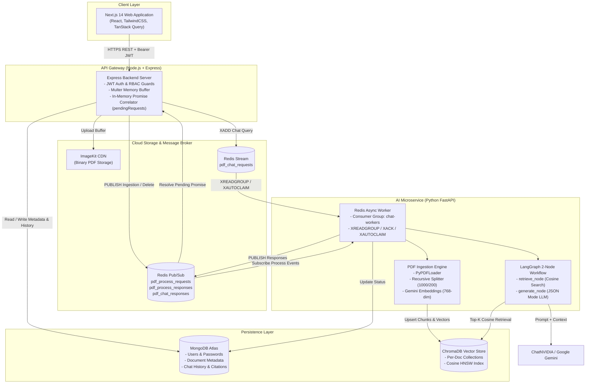

# RAG Chatbot — Enterprise Knowledge-Base System

An asynchronous, polyglot Enterprise Knowledge-Base Retrieval-Augmented Generation (RAG) system that enables organizations to securely ingest PDF documentation and query it conversationally with grounded answers and verifiable page citations.

Enterprise documentation—such as HR policies, technical handbooks, and standard operating procedures—is often siloed, unstructured, and tedious to search manually. This project solves that problem by transforming static PDF files into dense vector embeddings stored in ChromaDB, orchestrating a 2-node LangGraph RAG workflow, and serving accurate answers backed by page citations and suggested follow-up questions over a responsive Next.js web application.


---

## ✨ Features

- **Multi-Layer Role-Based Access Control (RBAC)**: Secure authentication with stateless JWT and bcrypt password hashing. Strictly separates administrative knowledge-base managers (`Admin`) from employees (`User`).
- **PDF Upload & Cloud Storage**: Validated multipart file uploads (15 MB cap, MIME and magic-byte checks) streamed to ImageKit CDN storage.
- **Automated Text Chunking & Embeddings**: Ingests PDFs using LangChain's `PyPDFLoader`, splits text using `RecursiveCharacterTextSplitter` (1,000-char chunks, 200-char overlap), and generates 768-dimensional dense vectors via Google Gemini `text-embedding-004`.
- **Isolated Vector Storage**: Employs a collection-per-document strategy in ChromaDB (`{"hnsw:space": "cosine"}`) for zero cross-document data leakage and instant $O(1)$ collection dropping on document deletion.
- **LangGraph Conversational RAG Pipeline**: A 2-node stateful graph (`retrieve_node` $\rightarrow$ `generate_node`) that searches ChromaDB for the top-$K$ semantic chunks and generates grounded answers via ChatNVIDIA / Gemini LLMs.
- **Verifiable Citations & Follow-up Suggestions**: Every answer includes evidence metadata (source filename, exact page number, text excerpt, and similarity confidence score) and 3 auto-generated follow-up questions.
- **Server-Side Conversation History**: Loads the last 5 Q&A turns directly from MongoDB; client-supplied conversation history is rejected to eliminate prompt injection risks.
- **Asynchronous Task Decoupling**: Offloads compute-heavy AI tasks through Redis, using **Redis Streams** with consumer groups (`chat-workers`) for durable chat queries and **Redis Pub/Sub** for document lifecycle events.
- **Fault-Tolerant Worker Recovery**: Automatic reconnection loops with exponential backoff ($1\text{s} \dots 60\text{s}$), explicit message acknowledgment (`XACK`), and stale task reclamation (`XAUTOCLAIM` with a 60-second idle threshold).
- **Optimistic Concurrency Control**: Tracks document mutations using `operationId` (UUIDv4) and `processingVersion` counters, preventing out-of-order background responses from corrupting active document states.

---

## 🏗️ Architecture

The system decouples fast I/O web routing from heavy AI/ML computation across two microservices communicating over Redis:



### Architectural Principles
1. **Separation of Concerns**: Node.js handles client sessions, authentication, and database persistence; Python focuses strictly on vector mathematics, PDF parsing, and LLM orchestration.
2. **Synchronous HTTP over Asynchronous Messaging**: An in-memory Request Correlation pattern (`pendingRequests` Map with a 30-second TTL) allows clients to use standard REST `POST /api/chat/ask` requests while the backend processes tasks asynchronously across Redis Streams.
3. **Database Isolation**: MongoDB serves as the relational System of Record for application data. ChromaDB serves strictly as a high-speed vector index.

---

## 🔄 How It Works

### 1. Document Processing Flow
```text
1. Admin uploads PDF ──► Node.js Gateway
2. Node.js streams file buffer to ImageKit CDN ──► Receives public CDN URL
3. Node.js creates MongoDB record ──► Status: PENDING, version: 1, currentOperationId: UUID
4. Node.js publishes event ──► Redis Pub/Sub: pdf_process_requests
5. Python worker receives message ──► Updates MongoDB status: PROCESSING
6. Python downloads PDF ──► Extracts text (PyPDFLoader) & splits into 1000-char chunks
7. Python generates 768-dim embeddings ──► Google Gemini text-embedding-004
8. Python upserts chunks into ChromaDB ──► Collection name = documentId
9. Python updates MongoDB ──► Status: COMPLETED, chunksCount, tokensCount
10. Python publishes response ──► Redis Pub/Sub: pdf_process_responses
11. Node.js validates operationId ──► Clears active operation lock
```

### 2. Conversational RAG Chat Flow
```text
1. User sends message ──► POST /api/chat/ask { sessionId, documentId, question }
2. Node.js verifies JWT ──► Validates document status == COMPLETED & session binding
3. Node.js fetches history ──► Retrieves last 5 Q&A turns from MongoDB
4. Node.js registers Promise ──► pendingRequests Map with requestId (30s timer)
5. Node.js appends to stream ──► XADD pdf_chat_requests
6. Python consumes from group ──► XREADGROUP (group: chat-workers)
7. LangGraph: retrieve_node ──► Embeds question & queries ChromaDB for top-5 chunks
8. LangGraph: generate_node ──► LLM produces grounded answer + 3 follow-up suggestions in JSON
9. Python publishes response ──► PUBLISH pdf_chat_responses (with requestId)
10. Python acknowledges stream ──► XACK pdf_chat_requests
11. Node.js subscriber matches ID ──► Resolves waiting Promise in pendingRequests
12. Node.js pre-save verification ──► Confirms document was not concurrently deleted
13. Node.js persists to MongoDB ──► Saves Q&A + citations to chatMessageModel
14. Client receives response ──► HTTP 200 { answer, sources, suggestedQuestions }
```

---

## 🧠 RAG Pipeline

| Pipeline Stage | Implementation Detail | Configuration |
| :--- | :--- | :--- |
| **Document Ingestion** | `PyPDFLoader` via `asyncio.to_thread` | Validates `%PDF` magic bytes before loading |
| **Text Chunking** | `RecursiveCharacterTextSplitter` | `chunk_size=1000`, `chunk_overlap=200`, separators: `["\n\n", "\n", " ", ""]` |
| **Embedding Model** | Google Gemini `text-embedding-004` | 768 output dimensions, prefixed with title and text metadata |
| **Vector Storage** | `chromadb.PersistentClient` (`./chroma_data`) | Isolated collection per document (`name = documentId`), metric: `cosine` |
| **Retrieval Node** | Semantic Vector Search in ChromaDB | Returns top-$K$ chunks ($K=5$) with text, page number, and similarity score |
| **Context Assembly** | Formatted string with confidence tags | `[Source 1 (confidence: XX.XX%)]\n<chunk_text>` |
| **Generation Node** | ChatNVIDIA / Google Gemini LLM | Single-shot prompt with strict context rules; output format: `json_object` |
| **Citations Extraction** | Normalized schema in MongoDB | Authoritative filename, page number, excerpt snippet, and cosine similarity |

---

## 🛠️ Tech Stack

| Layer | Technology | Purpose |
| :--- | :--- | :--- |
| **Frontend** | Next.js 14, React, TailwindCSS | Responsive UI, chat interface, document picker, admin dashboard |
| **State Management** | `@tanstack/react-query` | Asynchronous server-state caching, pagination, automatic refetching |
| **API Gateway** | Node.js, Express, TypeScript | REST API, route guards, validation, ImageKit integration, event dispatch |
| **File Storage** | ImageKit CDN | Cloud-hosted storage and delivery of uploaded PDF files |
| **Message Broker** | Redis (`ioredis` / `redis.asyncio`) | Redis Streams for chat queuing; Redis Pub/Sub for notifications |
| **Primary Database** | MongoDB Atlas (Mongoose) | System of Record for users, document metadata, and chat history |
| **AI Microservice** | Python 3.11, FastAPI | Asynchronous worker processing, LangChain, PyPDF document parser |
| **RAG Orchestration** | LangGraph, LangChain Core | 2-node stateful workflow (`retrieve_node` $\rightarrow$ `generate_node`) |
| **Vector Database** | ChromaDB | Persistent local vector store with cosine distance HNSW indexing |
| **Embeddings** | Google Gemini `text-embedding-004` | High-accuracy 768-dimensional dense vector embeddings |
| **Foundation Model** | ChatNVIDIA / Google Gemini | LLM answer generation and follow-up question synthesis |

---

## 📁 Project Structure

```text
RAG-Chatbot/
├── backend/                       # Node.js Express TypeScript API Gateway
│   ├── src/
│   │   ├── config/                # Environment variables and configuration
│   │   ├── middleware/            # JWT authentication, RBAC, and rate limiters
│   │   ├── models/                # Mongoose schemas (User, Document, ChatMessage)
│   │   ├── modules/
│   │   │   ├── auth/              # Auth controllers, services, and validators
│   │   │   ├── documents/         # Document upload, reprocess, delete, and list
│   │   │   └── chat/              # Chat gateway, session validation, history
│   │   ├── redis/                 # Redis publisher, subscriber, and pendingRequests Map
│   │   └── scripts/               # Admin bootstrap and database seeding scripts
│   ├── tests/                     # Automated baseline tests (Auth, Docs, Chat, Redis, RBAC)
│   └── package.json
│
├── python-ai/                     # Python FastAPI & LangGraph AI Microservice
│   ├── app/
│   │   ├── config.py              # Python service environment configuration
│   │   ├── db/                    # MongoDB status update client
│   │   ├── graph/                 # LangGraph RAG workflow (state, nodes, build_graph)
│   │   ├── ingestion/             # PyPDFLoader text extraction & Gemini embedder
│   │   ├── redis/                 # Redis async worker (Streams, Pub/Sub, XAUTOCLAIM)
│   │   └── vector/                # ChromaDB persistent client and collection manager
│   ├── tests/                     # Reliability and worker unit tests
│   ├── requirements.txt           # Python dependencies
│   └── run.py                     # Entry point for the AI worker
│
├── frontend/                      # Next.js 14 App Router Web Application
│   ├── app/
│   │   ├── admin/                 # Admin dashboard and document management routes
│   │   ├── auth/                  # Login and registration pages
│   │   └── page.tsx               # Main chat interface and document selector
│   ├── components/                # Modular React components (chat, admin, hooks)
│   ├── lib/                       # API client, auth sync, session management, types
│   ├── tests/                     # Frontend baseline unit tests
│   └── package.json
│
├── docs/                          # Comprehensive Technical Documentation
│   ├── architecture.md            # System architecture and design specification
│   ├── REDIS_ASYNC_PROCESSING.md  # Redis Streams, consumer groups, and recovery guide
│   ├── INTERVIEW_GUIDE.md         # 21-section technical interview preparation guide
│   └── api/
│       └── API_DOCUMENTATION.md   # Complete REST API endpoint reference
│
└── docker-compose.yml             # Multi-container orchestration (Redis, Python, Node, Frontend)
```

---

## 🚀 Getting Started

### Prerequisites
- **Node.js**: v20.x or higher
- **Python**: v3.11.x
- **Redis**: v7.x (local instance or Docker)
- **MongoDB**: Active MongoDB Atlas cluster or local MongoDB instance
- **API Keys**: Google Gemini API key, NVIDIA API key, and ImageKit credentials

### 1. Clone the Repository
```bash
git clone https://github.com/sham-jadhav03/RAG-ChatBot.git
cd RAG-ChatBot
```

### 2. Backend Setup
```bash
cd backend
npm install
npm run build
```

### 3. Frontend Setup
```bash
cd ../frontend
npm install
```

### 4. Python AI Service Setup
```bash
cd ../python-ai
python -m venv venv

# Windows:
.\venv\Scripts\activate
# Linux/macOS:
# source venv/bin/activate

pip install -r requirements.txt
```

### 5. Environment Variables Configuration

Create `.env` files in each service directory following these templates:

#### `backend/.env`
```ini
PORT=4000
MONGO_URI=mongodb+srv://<username>:<password>@cluster.mongodb.net/rag_chatbot?retryWrites=true&w=majority
JWT_SECRET=your_jwt_secret_key_here
JWT_EXPIRES_IN=1h
JWT_REFRESH_SECRET=your_jwt_refresh_secret_here
JWT_REFRESH_EXPIRES_IN=7d
IMAGEKIT_PUBLIC_KEY=your_imagekit_public_key
IMAGEKIT_PRIVATE_KEY=your_imagekit_private_key
IMAGEKIT_URL_ENDPOINT=https://ik.imagekit.io/your_id
REDIS_URL=redis://localhost:6379
CORS_ORIGIN=http://localhost:3000
INITIAL_ADMIN_USERNAME=admin
INITIAL_ADMIN_EMAIL=admin@example.com
INITIAL_ADMIN_PASSWORD=AdminSecurePassword123!
```

#### `python-ai/.env`
```ini
FASTAPI_HOST=0.0.0.0
FASTAPI_PORT=8000
FASTAPI_RELOAD=True
REDIS_URL=redis://localhost:6379
MONGO_URI=mongodb+srv://<username>:<password>@cluster.mongodb.net/rag_chatbot?retryWrites=true&w=majority
CHROMA_PATH=./chroma_data
CHUNK_SIZE=1000
CHUNK_OVERLAP=200
TOP_K_RETRIEVAL=5
GOOGLE_API_KEY=your_google_gemini_api_key
NVIDIA_API_KEY=your_nvidia_api_key
LLM_PROVIDER=nvidia
LLM_MODEL=nvidia/nemotron-3.5-lightning-30b-a3b
EMBEDDING_MODEL=models/embedding-001
LOG_LEVEL=INFO
```

#### `frontend/.env.local`
```ini
NEXT_PUBLIC_API_BASE_URL=http://localhost:4000
```

### 6. Run the Application

#### Option A: Docker Compose (All Services)
```bash
docker-compose up --build
```

#### Option B: Manual Local Execution (3 Terminals)

1. **Seed the Admin User & Start Backend (Terminal 1)**:
   ```bash
   cd backend
   npm run seed:admin
   npm run dev
   ```
2. **Start the Python AI Service (Terminal 2)**:
   ```bash
   cd python-ai
   .\venv\Scripts\activate
   python run.py
   ```
3. **Start the Frontend Web App (Terminal 3)**:
   ```bash
   cd frontend
   npm run dev
   ```

Open [http://localhost:3000](http://localhost:3000) in your browser.

---

## 🔐 Security

- **Stateless JWT Verification**: Evaluated on every protected endpoint via Express middleware.
- **Role-Based Access Control**: Document mutations (`POST /upload`, `DELETE /:id`, `GET /:id/reprocess`) are strictly guarded with `requireAdmin` on the backend API.
- **Password Salting & Hashing**: Handled via `bcryptjs` with 10 salt rounds; password hashes are omitted from Mongoose query projections by default (`select: false`).
- **Input Validation**: Strict schema and type checking across all controllers (`AuthValidator`, `DocumentValidator`, `ChatValidator`). Client-supplied `role` inputs during registration are rejected with `400 Validation Error`.
- **Upload Restrictions**: 15 MB file size limit, PDF MIME filtering, and header magic-byte verification (`%PDF`).
- **Session-Document Binding**: MongoDB integrity checks ensure sessions cannot be repurposed across different documents.
- *Notice on Non-Implemented Features*: Redis token blacklisting and active refresh-token rotation endpoints are not implemented; JWTs remain valid until standard expiration.

---

## ⚙️ Engineering Highlights

- **Decoupled Polyglot Architecture**: Isolates the Node.js event loop from heavy Python matrix calculations and LLM processing over Redis.
- **Durable Redis Stream Queuing**: Uses consumer groups (`chat-workers`) and explicit acknowledgments (`XACK`) to prevent dropped queries during worker reboots.
- **Automatic Task Reclamation (`XAUTOCLAIM`)**: Recovers and re-executes orphaned messages idle for longer than 60 seconds.
- **In-Memory Request Correlation**: Connects asynchronous message streams with synchronous client HTTP requests via the `pendingRequests` Map.
- **Optimistic Concurrency Control**: Prevents stale background responses from overwriting newer document versions using `operationId` and `processingVersion`.
- **Pre-Save Deletion Race Check (REL-03)**: Re-validates document existence before saving chat messages to prevent database orphan records.
- **Referential Snapshot Caching**: Solved React 18 `useSyncExternalStore` infinite render loops by stabilizing external storage object references.

---

## 🐛 Notable Engineering Challenges

### 1. Redis Streams vs. Pub/Sub Protocol Mismatch
- **Issue**: Chat requests published by Node.js using `XADD` were never received by the Python worker.
- **Root Cause**: Node.js appended entries to a persistent Redis Stream key, while Python was listening with `pubsub.subscribe()`. Because Redis Streams and Pub/Sub are independent subsystems, messages written to streams do not trigger Pub/Sub subscribers.
- **Resolution**: Refactored the Python worker to use `xreadgroup()` with consumer group `chat-workers`, reserving Pub/Sub strictly for lightweight response broadcasting.

### 2. Stale Document Processing Responses
- **Issue**: Triggering "Reprocess" while a document was already being ingested caused the UI status to glitch between `COMPLETED` and `PENDING`.
- **Root Cause**: Parallel background jobs finished out-of-order, allowing an earlier slow job to overwrite the status of a newer job.
- **Resolution**: Introduced `operationId` (UUIDv4) and `processingVersion` counters in MongoDB. Node.js rejects any response where `operationId !== document.currentOperationId`.

---

## 📚 Documentation Directory

Detailed specifications are maintained in the [`docs/`](file:///c:/Users/ghans/Devloper/RAG-Chatbot/docs) directory:

- [**System Architecture (`docs/architecture.md`)**](file:///c:/Users/ghans/Devloper/RAG-Chatbot/docs/architecture.md): End-to-end component breakdown, database responsibilities, and system design decisions.
- [**Redis & Async Processing (`docs/REDIS_ASYNC_PROCESSING.md`)**](file:///c:/Users/ghans/Devloper/RAG-Chatbot/docs/REDIS_ASYNC_PROCESSING.md): Complete guide to Redis Streams, consumer groups, `XAUTOCLAIM`, and correlation lifecycles.
- [**Technical Interview Guide (`docs/INTERVIEW_GUIDE.md`)**](file:///c:/Users/ghans/Devloper/RAG-Chatbot/docs/INTERVIEW_GUIDE.md): 21-section interview preparation guide covering technical rationale, bug stories, and trade-offs.
- [**REST API Documentation (`docs/api/API_DOCUMENTATION.md`)**](file:///c:/Users/ghans/Devloper/RAG-Chatbot/docs/api/API_DOCUMENTATION.md): Endpoint reference covering request/response schemas, query parameters, and error codes.

---

## 🧪 Testing

The test suites validate core business logic, input sanitization, RBAC boundaries, and Redis correlation:

### Backend Tests
```bash
cd backend
npm test
```
- **Runner**: Node.js native test runner via `tsx --test`.
- **Coverage**: 19 automated tests across 6 test suites covering registration validation, document parameters, chat inputs, Redis request correlation, and RBAC middleware enforcement.

### Frontend Tests
```bash
cd frontend
npm test
```
- **Runner**: `tsx --test`.
- **Coverage**: 5 automated tests across 3 suites covering unique session management and API error handling.

### Python Service Tests
```bash
cd python-ai
python -m unittest discover tests
```
- **Runner**: Python `unittest`.
- **Coverage**: Validates Redis worker connection socket timeouts, dedicated pub/sub clients, `XAUTOCLAIM` stale message recovery, and explicit `XACK` acknowledgment.

---

## 📸 Screenshots / Demo

> Screenshots and demonstration recordings can be added here.

---

## 🎯 Why This Project?

1. **Practical Enterprise Value**: Demonstrates an end-to-end solution for private knowledge search that eliminates manual search overhead.
2. **Grounded AI Answers**: Replaces unanchored LLM outputs with verifiable context chunks tagged with page numbers and similarity scores.
3. **Production-Minded System Design**: Moves beyond basic single-script tutorials by implementing a polyglot microservice architecture, asynchronous event queuing, and optimistic concurrency control.

---

## 👨‍💻 Author

- **Sham Jadhav**
- GitHub: [@sham-jadhav03](https://github.com/sham-jadhav03)

---

## 📄 License

This project is licensed under the [ISC License](https://opensource.org/licenses/ISC) as declared in `backend/package.json`.
